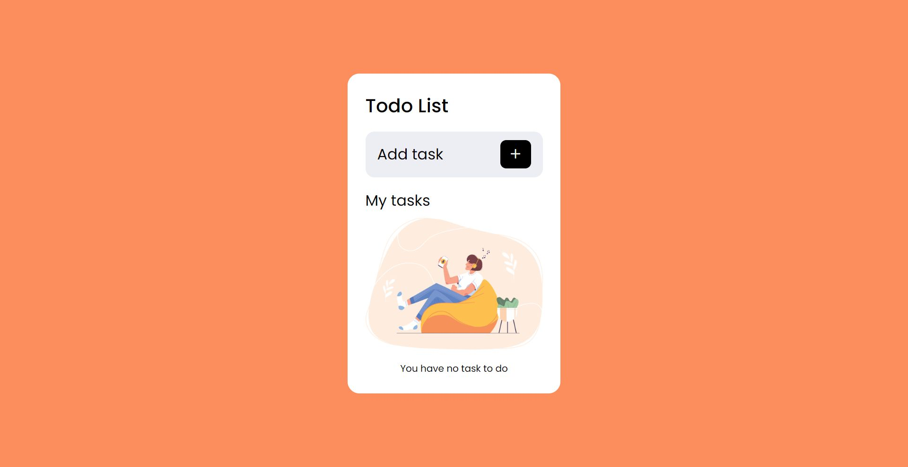

# React todo list app

This is a react app that enables users to manage tasks
# Setup

This project was bootstrapped with [Create React App](https://github.com/facebook/create-react-app).

## Table of contents

- [Overview](#overview)
  - [The aim](#the-aim)
  - [Screenshot](#screenshot)
  - [Screen record](#screen-record)
  - [Links](#links)
- [My process](#my-process)
  - [Built with](#built-with)
  - [What I learned](#what-i-learned)
  - [Continued development](#continued-development)
  - [Useful resources](#useful-resources)
- [Author](#author)
- [Acknowledgments](#acknowledgments)

## Overview

### The aim

Users would be able to:

- View the optimal layout for the site depending on their device's screen size

- Add tasks

- Mark tasks as completed

- Delete taks

### Screenshot



### Screen record


https://user-images.githubusercontent.com/109084070/187085410-7119157b-0a30-485e-ac9b-72b25867adb9.mp4


### Links

- Live Site URL: [https://fb-react-todo-list.netlify.app/](https://fb-react-todo-list.netlify.app/)
- Github Repository: [https://fb-react-todo-list.netlify.app/](https://fb-react-todo-list.netlify.app/)

## My process

### Built with

- Semantic HTML5 markup
- CSS custom properties
- Flexbox
- Mobile-first workflow
- [React](https://reactjs.org/) - JS library
- [CSS Modules]
- [Bootstrap](https://icons.getbootstrap.com/) - Icon Library

### What I learned

I learnt about Portals in react. Although the attribution was declared in the App Component, I was able to render it in the footer tag in the public/index.html

Code snippets for that added below:

```html
<body>
  <noscript>You need to enable JavaScript to run this app.</noscript>
  <div id="root"></div>
  <footer id="attribution"></footer>
</body>
```
```jsx
{ReactDom.createPortal(<Attribution/>, document.getElementById("attribution"))}
```

### Continued development

I intend to learn more about react hooks

### Useful resources

- [React - The complete guide](https://www.udemy.com/course/react-the-complete-guide-incl-redux/) - This course by Maximilian Schwarzmüller helped me understand best practices while working with ReactJS.


## Author

- Twitter - [@yourusername](https://www.twitter.com/brightadigwe)

## Acknowledgments

I'd Like to thank Maximilian Schwarzmüller - (https://www.udemy.com/user/maximilian-schwarzmuller/) . His "React - The Complete Guide" course is top notch.
